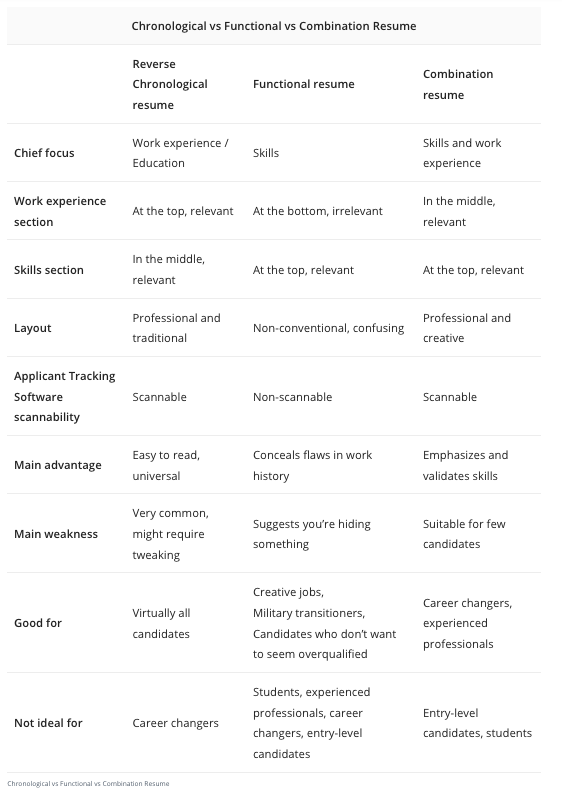

# 简历编写手册

## 参考

- [Resume Formats: Pick the Best One in 3 Steps](https://zety.com/blog/resume-formats)
- [Software Engineer Resume: Guide and a Sample](https://zety.com/blog/software-engineer-resume)

## 布局

### 1. reverse-chronological

- Contact information
- Resume summary or resume objective
- Work experience
- Education
- Skills
- Additional Sections

### 2. combination

- Contact information
- Skills Summary
- Additional Skills
- Work Experience
- Education

### 3. functional

- Contact information
- Resume objective
- Skills Summary
- Additional Skills
- Work Experience
- Education

### comparison between the 3 resume formats

## 组件

### Summary/Objective

- Summary
5+ 年工程师请写简历摘要(大致对标某些模板中的“自我评价”)，重点是工作中的shining moment

- Objective
应届生或打算转岗的写一下求职目标。

### Experience
工作经历按照从近到远的顺序书写，写4~5项与jd相关的内容。要突出结果而不是过程！

### Education
实习生需要认真填写的内容！

### Skills

- 收集简历技能关键字

- 选出符合的，不只是列出来，还要有证明 - 即和工作经历中的内容进行呼应！

### Online Portfolio

- 把一些面试官可能感兴趣的内容放到网上，比如可以是自己的博客、Github的主页等等

### Cover Letter

- 

## Page

### Resume - 简历正文

`src/views/Home.vue`

### Cover Letter - 求职信

