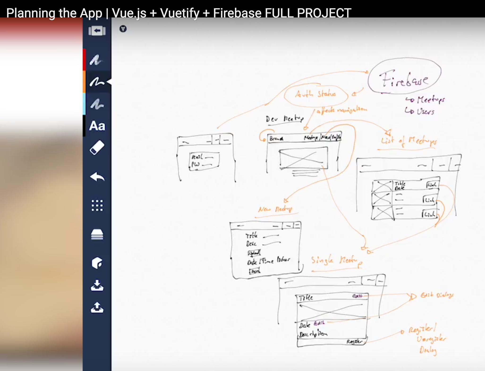

# Vue.js + Vuetify + MySQL 项目开发教程

## 1. 需求与概要设计
做一个聚会管理网站，管理员可以添加聚会信息；普通用户可以查看聚会信息。根据需求，提取出 5 张页面和 2 个数据表。



### 1.1 页面

* 登录
* 聚会主页
* 聚会列表
* 聚会详情
* 聚会添加

### 1.2 数据表

* 用户表
* 聚会信息表

## 2. 创建项目
参考

* [webpack@github](https://github.com/vuetifyjs/webpack)
* [quick-start](https://vuetifyjs.com/zh-Hans/getting-started/quick-start)

```bash
$ npm install -g vue-cli #全局安装
$ vue init vuetifyjs/webpack my-project
$ cd my-project
$ npm install
$ npm run dev
```

### 2.1 前端页面说明
```bash
➜  vuetify-tutorials git:(master) ✗ ll src
App.vue # 页面全局显示
assets/
components/
main.js # 主配置
router.js <== router/index.js # 路由
```

## 3. Vuetify 起步

### 3.1 页面添加 header - toolbar

* `src/App.vue` 删掉初始内容，重新添加 toolbar 相关内容
* Components/[toolbars](https://vuetifyjs.com/en/components/toolbars) with title and items
* Components/[buttons](https://vuetifyjs.com/zh-Hans/components/buttons)
* Layout/[grid](https://vuetifyjs.com/en/layout/grid#example-spacer)
* [Material Icons](https://material.io/icons/)

### 3.2 页面添加 左侧导航 - navigation-drawer

* `src/App.vue` 在 toolbar 下写导航抽屉
* Components/[Navigation drawer](https://vuetifyjs.com/en/components/navigation-drawers)
* Layout/[display](https://vuetifyjs.com/en/layout/display) 展示控制

### 3.3 网站颜色和主题

* `src/App.vue` 在 toolbar 上添加颜色; 两种theme，dark和默认的light
* Styles/[colors](https://vuetifyjs.com/en/style/colors)
* `src/main.js` 定制主题， class="cyan darken-3" => class="primary"
* Styles/[theme](https://vuetifyjs.com/en/style/theme)

## 附录-参考文献

### 官方文档

* [https://vuetifyjs.com](https://vuetifyjs.com)
* [awesome-vuetify@github](https://github.com/vuetifyjs/awesome-vuetify)

### Tutorials on YouTube

1. [Planning the App](https://www.youtube.com/watch?v=dIkPb8krORU)
2. [Setting the Project up](https://www.youtube.com/watch?v=CM-ui3tjgdk)
3. [First Steps with Vuetify](https://www.youtube.com/watch?v=NMFoyAnWkOE)
4. [Dynamic Menu](https://www.youtube.com/watch?v=e4M2MvU5QuQ)
5. []()
6. []()