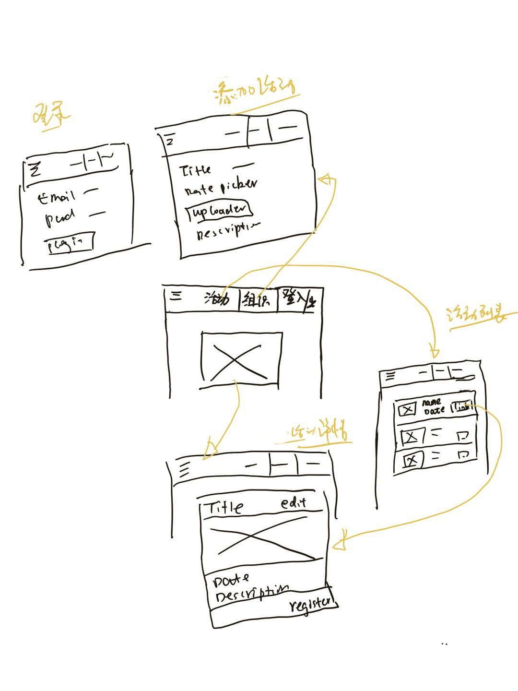

# Vue.js + Vuetify + MySQL 项目开发教程

## 1. 需求与概要设计
> 做一个聚会管理网站，管理员可以添加聚会信息；普通用户可以查看聚会信息。



根据以上的需求，可以提取出 5 张页面和 2 个数据表。

### 1.1 页面

* 登录
* 聚会主页
* 聚会列表
* 聚会详情
* 聚会添加

### 1.2 数据表

* 用户表
* 聚会信息表

## 2. 创建项目
参考

* [webpack@github](https://github.com/vuetifyjs/webpack)
* [quick-start](https://vuetifyjs.com/zh-Hans/getting-started/quick-start)

```bash
$ npm install -g vue-cli #全局安装
$ vue init vuetifyjs/webpack my-project
$ cd my-project
$ npm install
$ npm run dev
```

### 2.1 初始参数

```bash
➜  vuetify-tutorials git:(master) ✗ proxychains4 vue init vuetifyjs/webpack -y
? Generate project in current directory? Yes
? Project name vuetify-tutorials
? Project description A Vue.js project
? Author twotwo <twotwo.li@gmail.com>
? Vue build standalone
? Install vue-router? Yes
? Use ESLint to lint your code? Yes
? Pick an ESLint preset Standard
? Set up unit tests Yes
? Pick a test runner jest
? Setup e2e tests with Nightwatch? No
? Use a-la-carte components? No
? Use custom theme? Yes
? Should we run `npm install` for you after the project has been created? (recommended) npm

   vue-cli · Generated "vuetify-tutorials".
...
# Project initialization finished!
# ========================

To get started:

  npm run dev

Documentation can be found at https://vuejs-templates.github.io/webpack
```

### 2.2 前端页面说明
```bash
➜  vuetify-tutorials git:(master) ✗ ll src
App.vue # 页面全局显示
assets/
components/
main.js # 主配置
router.js <== router/index.js # 路由
```

## 3. Vuetify 起步

### 3.1 网站布局(layout)

* `src/App.vue` app: {navigation, toolbar, content, footer}
* Layout/[Default application markup](https://vuetifyjs.com/zh-Hans/layout/pre-defined) 

### 3.2 网站颜色和主题

* `src/App.vue` 在 toolbar 上添加颜色; 两种theme，dark和默认的light
* Styles/[colors](https://vuetifyjs.com/en/style/colors)
* `src/main.js` 定制主题颜色， class="cyan darken-3" => class="primary"
* Styles/[theme](https://vuetifyjs.com/en/style/theme)

### 3.3 页面添加 header - toolbar

* `src/App.vue` 删掉初始内容，重新添加 toolbar 相关内容
* Components/[toolbars](https://vuetifyjs.com/en/components/toolbars) with title and items
* Components/[buttons](https://vuetifyjs.com/zh-Hans/components/buttons)
* Layout/[grid](https://vuetifyjs.com/en/layout/grid#example-spacer)
* [Material Icons](https://material.io/icons/)

### 3.4 页面添加 左侧导航 - navigation-drawer

* `src/App.vue` 在 toolbar 下写导航抽屉
* Components/[Navigation drawer](https://vuetifyjs.com/en/components/navigation-drawers)
* Layout/[display](https://vuetifyjs.com/en/layout/display) 展示控制

## 4. 动态菜单

### 4.1 动态加载菜单

`src/App.vue`

1. `<script>` 中添加 menuItems
2. v-list-tile 中添加 v-for
3. v-btn 中添加 v-for

### 4.2 添加页面

* `src/components/Main.vue`
* `src/components/Meetup/CreateMeetup.vue`
* `src/components/Meetup/Meetups.vue`
* `src/components/User/Profile.vue`
* `src/components/User/Signin.vue`
* `src/components/User/Signup.vue`

### 4.3 添加路由

参考 [vue-router](https://router.vuejs.org/zh-cn/)

* `src/App.vue` 添加 <router-view/>
* `src/routes.js` 不用# => `mode: 'history'`, 设置web context => `base: '/meetup'`
* `config/index.js` 设置web context => `assetsPublicPath: '/meetup'`

http://localhost:8080/meetup

### 4.4 菜单中添加地址

`src/App.vue`

* v-toolbar-title 中添加 router-link => `style="cursor: pointer"`

## 5. 首页的轮播图

* `src/components/Main.vue`
* Components/[carousels](https://vuetifyjs.com/en/components/carousels) ['kærə'sɛl] 旋转木马

### 5.1 首页布局

* Layout/[12点栅格](https://vuetifyjs.com/en/layout/grid) v-container » v-layout » v-flex
* Layout/[显示](https://vuetifyjs.com/en/layout/grid)
* Layout/[文本对齐](https://vuetifyjs.com/zh-Hans/layout/alignment)
* Layout/[间距](https://vuetifyjs.com/zh-Hans/layout/spacing)

### 5.2 首页轮播图

使用 carousels 组件

## 6. 聚会列表及详情

### 6.1 Meetups.vue

* Components/[cards](https://vuetifyjs.com/zh-Hans/components/cards)
* Layout/[间距](https://vuetifyjs.com/zh-Hans/layout/spacing)
* [Material Icons](https://material.io/icons/)
* Layout/[偏移](https://vuetifyjs.com/zh-Hans/layout/grid#offset)

### 6.2 Meetup.vue及路由

* `src/components/Meetup/Meetup.vue`
* `src/routers.js`

### 6.3 在 Home.vue 上添加点击

* line 18: `@click="onLoadMeetup(meetup.id)"`
* line 54: `methods...` //目前点击不生效...
* line 13: `style="cursor: pointer;` //add pointer to carousel

## 7. 使用 Vuex 管理状态

### 7.1 安装与引入

```bash
➜  vuetify-tutorials git:(master) ✗ npm i --save vuex
➜  vuetify-tutorials git:(master) ✗ code src/store.js
```

Vuex.Store: state, mutations, actions, getters

* `src/store.js`
* `src/main.js` import {store} from './store.js'

### 7.2 从Vuex.Store中获得聚会信息

* `src/components/Home.vue`: 使用 `computed` 获取meetups
* `src/components/Meetup/Meetups.vue`: 使用 `computed` 获取meetups，然后在 `v-layout` 上添加 `v-for`
* `src/components/Meetup/Meetup.vue`: 获取 meetup - 使用 props 获得路由过来的 id
* `src/router.js`: `props: true,`

### 7.3 创建聚会信息

`src/components/Meetup/CreateMeetup.vue`

* Components/Inputs & controls/[文本框](https://vuetifyjs.com/zh-Hans/components/text-fields)
* `src/store.js` 添加 createMeetup。 actions.createMeetup中写死id

#### 7.3.1 创建聚会信息之日期时间控件

* Components/Pickers/[Date/month picker](https://vuetifyjs.com/zh-Hans/components/date-pickers)
* Components/Pickers/[Time picker](https://vuetifyjs.com/zh-Hans/components/time-pickers)

Add in `src/components/Meetup/CreateMeetup.vue`

#### 7.3.2 添加日期管道
* create `src/filter_date.js`
* register in `src/main.js`
* add pipeline in `src/components/Meetup/Meetups.vue`/`src/components/Meetup/Meetup.vue`

## 8. 用户与权限

### 8.1 用户注册

* create `src/components/User/Signup.vue`
* Components/Inputs & controls/[文本框](https://vuetifyjs.com/zh-Hans/components/text-fields) rules add in Vue.computed

## 附录1-Firebase相关

### Authentication

12. [A Signup View & Form with Firebase](https://www.youtube.com/watch?v=MpiMn5Bcmdg) 2017/8/7 `npm i firebase --save`

* [创建项目](./tutorials/firebase-create-project.png)
* [认证方法](./tutorials/firebase-authentication-method.png)
* [认证配置](./tutorials/firebase-authentication-websetup.png) register in `src/main.js`

## 附录2-参考文献

### 官方文档

* [https://vuetifyjs.com](https://vuetifyjs.com)
* [awesome-vuetify@github](https://github.com/vuetifyjs/awesome-vuetify) Vuetify.js 官方推荐资源
* [Tutorials@github](https://github.com/academind/yt-devmeetup-vue-firebase) YouTube教学视频的源代码

### Tutorials on YouTube

[Vue.js + Vuetify + Firebase Project - DevMeetup](https://www.youtube.com/watch?v=FXY1UyQfSFw&list=PL55RiY5tL51qxUbODJG9cgrsVd7ZHbPrt) 24个视频，把预告和vuetify版本升级 2 个去掉了

1. [Planning the App](https://www.youtube.com/watch?v=dIkPb8krORU)
2. [Setting the Project up](https://www.youtube.com/watch?v=CM-ui3tjgdk)
3. [First Steps with Vuetify](https://www.youtube.com/watch?v=NMFoyAnWkOE)
4. [Dynamic Menu](https://www.youtube.com/watch?v=e4M2MvU5QuQ)
5. [A Carousel on the Home Page](https://youtu.be/at6QjSwKOuA)
6. [Adding a Meetup List & Single Meetup Card](https://www.youtube.com/watch?v=AesqUS2udb4) 2017/7/24
7. [Manage State with Vuex](https://www.youtube.com/watch?v=GcyjaJZaVLg) 2017/7/27
8. [Adding a "Create Meetup" Form](https://www.youtube.com/watch?v=hjqywdE2IAc) 2017/7/31
9. [Adding Date & Time Pickers](https://www.youtube.com/watch?v=mhK761NH5EA)
10. [Adding a Date Filter (Pipe)](https://www.youtube.com/watch?v=X8mpO9Fn2_Y)
11. [Firebase](https://www.youtube.com/watch?v=_gR-L7atGCM)
12. [A Signup View & Form with Firebase](https://www.youtube.com/watch?v=MpiMn5Bcmdg) 2017/8/7 `npm i firebase --save`
13. [Adding Firebase Authentication](https://www.youtube.com/watch?v=MdZCRP2uKdE) 2017/8/10
14. [Auth State Feedback with Vuex](https://www.youtube.com/watch?v=fuhhQFt5Ybk) 2017/8/14
15. [Storing Data on Firebase](https://www.youtube.com/watch?v=xwx4ua056Nc) 2017/8/17
16. [Prevent unauthenticated Access](https://www.youtube.com/watch?v=XljsGqsZyL4) 2017/8/21
17. [Uploading Images](https://www.youtube.com/watch?v=J2Wp4_XRsWc) 2017/8/24
18. [Editing Meetups](https://www.youtube.com/watch?v=zKRdwpMEaP8) 2017/8/28
19. [Editing Date and Time](https://www.youtube.com/watch?v=fls6uX7WWSs) 2017/8/31
20. [Register for Meetups](https://www.youtube.com/watch?v=d4nUU8vCT8U) 2017/9/4
21. [Fetching User State](https://www.youtube.com/watch?v=BZ9FcjsA9ZU) 2017/9/7
22. [Finishing Our Project](https://www.youtube.com/watch?v=0RoT17Xwj24) 2017/9/11