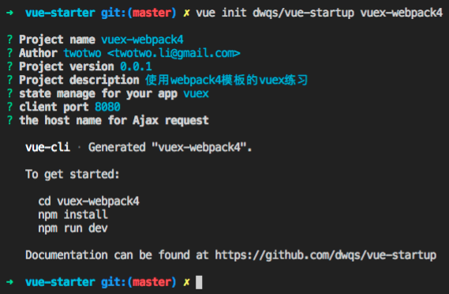

# Vuex 基础

## 0. vuex intro

[What is Vuex?](https://vuex.vuejs.org/zh-cn/intro.html)

### 0.1 State Management Pattern


### 0.2 When Should I Use It

当应用非常非常简单，例如应用中只有一个业务对象(row data object)时，可以使用[简单状态管理](https://cn.vuejs.org/v2/guide/state-management.html#简单状态管理起步使用)


## 1. setup

```bash
$ vue init dwqs/vue-startup vuex-webpack4

？Project Name
```



### 1.1 Vue.js webpack 4 模板

<https://github.com/dwqs/vue-startup>

### 1.2 eslint fix

`npx eslint src/**/*.js src/**/*.vue --fix`

## 2 sample code(without vuex)

<https://github.com/mschwarzmueller/vuejs2-vuex-basics>

### 2.1 add

* src/general/vuex/Index.vue // 维护用户信息和注册信息的数据，和获取相关数据的方法；
* src/general/vuex/Registration.vue // 用户注册的交互和逻辑实现：显示 Index 中的未注册用户(props: ["users"])，调用注册方法(this.$emit("userRegistered", user))
* src/general/vuex/Registrations.vue // 取消注册的交互及逻辑

### 2.2 modify

引入内容，更新路由

* src/page/index.js `const App = () => import(/* webpackChunkName: "main" */ "../general/vuex/Index")`

## 3. State & Store

### 3.1 把用户信息和注册信息的数据挪到 state 中

* src/general/vuex/store.js // 把 Index 中的数据放到 state 中
* src/page/index.js //引入 store - import { store } from "../general/vuex/store"
* src/general/vuex/Registration.vue // computed.users， 直接从 store.state 获取，替换 Index.unregisteredUsers
* src/general/vuex/Registrations.vue // computed.registrations， 直接从 store.state 获取，替换 Index.registrations

### 3.2 去掉 Index.vue 传入的数据和方法

* src/general/vuex/Index.vue // <app-registration></app-registration>
* src/general/vuex/Registration.vue // registerUser ==> Index.userRegistered 直接调用 store.state
* src/general/vuex/Registrations.vue // unregister ==> Index.userUnregistered

### 3.3 修改：注册后不显示

* src/general/vuex/Registration.vue // computed.users.filter
